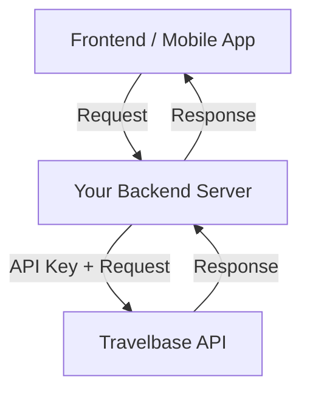
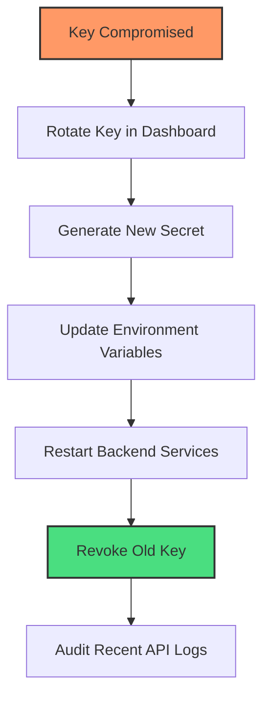

<Note>
    ### Server-side authentication only
    Travelbase API keys are designed for **secure server-to-server communication**.
    Never expose your API keys in client-side code such as browsers, mobile apps, or public repositories.
</Note>

<Card title="Manage keys in the dashboard" icon="layout-dashboard">
    API keys are created and managed in the Travelbase dashboard.

    Use the dashboard to:

    - Create new API keys
    - Rotate compromised keys
    - Revoke unused keys
    - View usage and activity

    [//]: # (<Button href="https://dashboard.travelbase.ai" variant="primary">)

[//]: # (    Open dashboard)

[//]: # (</Button>)
</Card>


## Using your API key

<Card title="Authenticate requests" icon="key">
    Include your API key in the `x-api-key` header for every request.
</Card>

### Example request

```bash
curl https://sandbox.travelbase.ai/v1/tenant \
  -H "x-api-key: tb_live_xxxxxxxxxxxxxxxxx"
```
Travelbase uses API keys to:

* **Identify your tenant**
* **Authorize access to resources**
* **Track usage and activity**

## API key environments

<CardGroup cols={2}>
    <Card title="Sandbox keys" icon="flask">
        Used for testing and development. Sandbox keys cannot access live data and are safe for non-production use.
    </Card>
    <Card title="Live keys" icon="rocket">
        Used for production systems. Live keys have access to real tenant data and must be handled securely.
    </Card>
</CardGroup>

## Security best practices

<CardGroup cols={2}>
    <Card title="Store keys securely" icon="lock">
        Store API keys in secure environments such as:
        * Environment variables
        * Secret managers
        * Secure backend configuration

        **Never store keys in source code.**
    </Card>
    <Card title="Never expose client-side" icon="eye-slash">
        Do not include API keys in:
        * Frontend JavaScript
        * Mobile apps
        * Public repositories

        **API keys must only be used from your server.**
    </Card>
    <Card title="Rotate keys regularly" icon="rotate">
        Rotate API keys periodically to reduce risk exposure. Immediately rotate keys if they are exposed or compromised.
    </Card>
    <Card title="Use separate keys per environment" icon="puzzle-piece">
        Use different keys for:
        * Development
        * Staging
        * Production

        This prevents accidental access to live systems.
    </Card>
</CardGroup>

## Recommended integration pattern

<Card title="Secure architecture" icon="shield">
    Your server should act as a secure intermediary between your application and the Travelbase API.
</Card>




# Authentication

All requests to the Travelbase Tenant API must be authenticated using an API key.
API keys uniquely identify your tenant, authorize access to resources, and enable secure, auditable communication between your systems and the Travelbase platform.

## Key Format

Travelbase API keys use specific prefixes to help you distinguish between environments at a glance. This prevents accidentally using production keys during development.

| Prefix | Environment | Description |
| :--- | :--- | :--- |
| `tb_sandbox_` | **Sandbox** | Used for development and testing without affecting real data. |
| `tb_live_` | **Live** | Used for production environments and real transactions. |

> **Example:** `tb_live_2YotnFZFEjr1zCsicMWpAA`

---

## Security & Compromised Keys

If you suspect your API key has been exposed or compromised, you must act quickly to prevent unauthorized access to your tenant data.

### Emergency Rotation Workflow

Follow this sequence to secure your account without causing prolonged downtime:


<Card title="Immediate Actions" icon="triangle-exclamation" color="#ca8a04">
    If your security is breached:

    Rotate the API key from the dashboard immediately.

    Update your backend environment variables with the new key.

    Review recent API activity logs for suspicious behavior.

    Remove any hardcoded keys from your code or public repositories.
</Card>

<CardGroup cols={2}>
    <Card title="Tenant" icon="building" href="/tenant-api/tenant">
        Learn how to retrieve and manage specific tenant information.
    </Card>
    <Card title="Webhooks" icon="webhook" href="/tenant-api/webhooks">
        Set up webhooks to receive real-time events and updates.
    </Card>
</CardGroup>