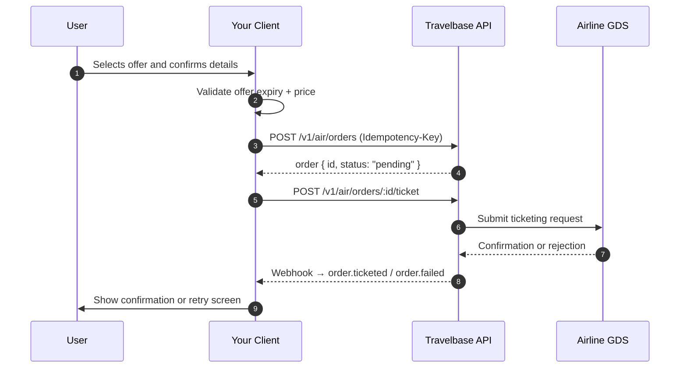
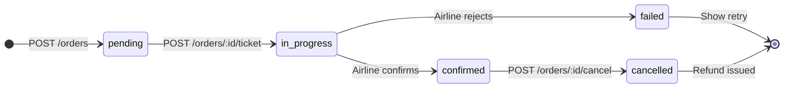

<Warning>
    Booking a flight is a **stateful, financial operation**. Every step must be idempotent, every outcome must be handled, and ticketing is always asynchronous. Read this guide fully before integrating.
</Warning>

---

## Mental model

Flight booking in Travelbase is best understood as a **distributed transaction with an external airline dependency**. Unlike a typical REST request, the outcome is not determined by the HTTP response — it's determined by the airline's confirmation, which arrives asynchronously.

```
Your system → Travelbase API → Airline GDS → Confirmation
```

This means:

- The API call **creates intent** — it does not confirm the booking
- The order enters a `pending` state immediately
- The final outcome (`ticketed` or `failed`) arrives via **webhook**
- Your UI and backend must be designed around this three-state model

<CardGroup cols={2}>
    <Card title="Idempotency is mandatory" icon="shield-check">
        Every order creation request must carry a unique `Idempotency-Key`. Without it, retries during network failures can create duplicate charges.
    </Card>
    <Card title="Webhooks are the source of truth" icon="bell">
        Never assume success from an HTTP `200`. Listen to `order.ticketed` and `order.failed` webhooks to drive your confirmation flow.
    </Card>
    <Card title="Offers are time-sensitive" icon="clock">
        An offer that was valid 90 seconds ago may already be expired or re-priced. Always validate immediately before booking.
    </Card>
    <Card title="Failures are recoverable" icon="rotate-left">
        A `failed` order means no ticket was issued and no charge was applied. Expose a clean retry path — don't dead-end the user.
    </Card>
</CardGroup>

---

## End-to-end flow



---

## Quickstart

<Steps>

    <Step title="Validate the offer">

        Before creating an order, confirm the selected offer is still valid. Calling the booking endpoint with an expired offer will return a `422` and waste a round trip.

        ```bash
        GET /v1/air/offers/off_0000AEdFkLPQNPPHhwYUJk
        Authorization: Bearer <token>
        ```

        ```json
        {
            "data": {
            "id": "off_0000AEdFkLPQNPPHhwYUJk",
            "total_amount": "432.50",
            "total_currency": "USD",
            "expires_at": "2025-09-14T12:45:00Z",
            "payment_requirements": {
            "requires_instant_payment": true,
            "price_guarantee_expires_at": "2025-09-14T12:30:00Z"
        }
        }
        }
        ```

        Check the following before proceeding:

        | Check | Field | Condition |
        |---|---|---|
        | Offer not expired | `expires_at` | Must be > `now + 60s` |
        | Price still guaranteed | `payment_requirements.price_guarantee_expires_at` | Must be in the future |
        | Balance sufficient | Internal | User wallet ≥ `total_amount` |

        <Tip>
            Apply a **60-second buffer** when checking `expires_at`. Clocks drift, and a booking initiated at `T-5s` before expiry will almost certainly fail by the time it reaches the airline.
        </Tip>

    </Step>

    <Step title="Create the order">

        Submit the booking with passenger details and the selected offer ID. This is the only step where idempotency is enforced — generate a unique key per user intent, not per retry.

        ```bash
        POST /v1/air/orders
        Authorization: Bearer <token>
        Idempotency-Key: usr_29fGhq-1726310400000
        Content-Type: application/json
        ```

        ```json
        {
            "selected_offers": ["off_0000AEdFkLPQNPPHhwYUJk"],
            "passengers": [
        {
            "id": "pas_0000AEdFkLPQNPPHhwYUJa",
            "title": "mr",
            "given_name": "James",
            "family_name": "Okafor",
            "gender": "m",
            "born_on": "1990-07-22",
            "email": "james.okafor@example.com",
            "phone_number": "+2348012345678",
            "identity_documents": [
        {
            "type": "passport",
            "number": "A12345678",
            "issuing_country_code": "NG",
            "expires_on": "2030-01-01"
        }
            ]
        }
            ],
            "payments": [
        {
            "type": "balance",
            "amount": "432.50",
            "currency": "USD"
        }
            ]
        }
        ```

        **Response**

        ```json
        {
            "data": {
            "id": "ord_0000AEdGhpKLMNOPQrsTUv",
            "booking_reference": "TBXQ7F",
            "status": "pending",
            "created_at": "2025-09-14T12:28:03Z",
            "passengers": [...],
            "slices": [...],
            "total_amount": "432.50",
            "total_currency": "USD"
        }
        }
        ```

        <Warning>
            The `Idempotency-Key` must be **unique per booking intent** — not per API call. Generate it once when the user initiates checkout and reuse it on every retry for that same booking. Using a new key on each retry defeats the purpose entirely.
        </Warning>

        <Note>
            `status: "pending"` is the only status you will see in this response. The order has been accepted — not confirmed. Proceed to the ticketing step immediately.
        </Note>

    </Step>

    <Step title="Issue the ticket">

        Trigger ticketing by calling the ticket endpoint with the order ID returned in the previous step. This transitions the order into active processing with the airline.

        ```bash
        POST /v1/air/orders/ord_0000AEdGhpKLMNOPQrsTUv/actions/ticket
        Authorization: Bearer <token>
        ```

        ```json
        {
            "data": {
            "id": "ord_0000AEdGhpKLMNOPQrsTUv",
            "status": "pending",
            "ticketing_status": "in_progress"
        }
        }
        ```

        <Note>
            The ticket endpoint also returns `pending`. The airline confirmation happens out-of-band. Display a processing screen to the user and **wait for the webhook** to drive the next state.
        </Note>

    </Step>

    <Step title="Handle the webhook outcome">

        Subscribe to `order.ticketed` and `order.failed` on your webhook endpoint. These are the authoritative events that determine what the user sees.

        **order.ticketed**

        ```json
        {
            "event": "order.ticketed",
            "data": {
            "id": "ord_0000AEdGhpKLMNOPQrsTUv",
            "booking_reference": "TBXQ7F",
            "status": "confirmed",
            "documents": [
        {
            "type": "electronic_ticket",
            "url": "https://cdn.travelbase.io/tickets/ET1234567890.pdf"
        }
            ]
        }
        }
        ```

        **order.failed**

        ```json
        {
            "event": "order.failed",
            "data": {
            "id": "ord_0000AEdGhpKLMNOPQrsTUv",
            "status": "failed",
            "failure_reason": "airline_rejected",
            "payment_reversed": true
        }
        }
        ```

        <Tip>
            Always respond to webhook delivery with `HTTP 200` **before** running your fulfilment logic. If your handler throws, Travelbase will retry — but your logic may have partially executed. Acknowledge first, process asynchronously.
        </Tip>

    </Step>
</Steps>

---

## Order lifecycle

An order moves through a defined set of states. Your application must handle all of them gracefully.



| Status | Description | Next action |
|---|---|---|
| `pending` | Order created, awaiting ticketing call | Call `/actions/ticket` |
| `in_progress` | Ticketing submitted to airline | Wait for webhook |
| `confirmed` | Ticket issued, booking complete | Show confirmation + emit ticket |
| `failed` | Airline rejected — no charge applied | Offer retry or alternative |
| `cancelled` | Booking voided post-confirmation | Process refund, notify user |

<Warning>
    Do not poll the order status endpoint as a substitute for webhooks. Polling introduces latency, consumes rate limit quota, and creates race conditions. If you need a fallback, poll **once** after 30 seconds only if no webhook has arrived.
</Warning>

---

## Idempotency in depth

Idempotency is your primary defence against duplicate bookings and double charges during network failures or retries.

**How to generate idempotency keys**

```javascript
// Combine user ID + booking intent timestamp
// Use the same key for every retry of the same booking
const idempotencyKey = `${userId}-${checkoutSessionId}`;

//  Correct — same intent, same key
fetch("/v1/air/orders", {
method: "POST",
    headers: {
    "Idempotency-Key": idempotencyKey,
        "Authorization": `Bearer ${token}`,
},
body: JSON.stringify(orderPayload),
});
```

**Rules**

- Keys must be **unique per booking intent** — not per HTTP call
- Keys are scoped to your account and expire after **24 hours**
- If Travelbase receives a duplicate key, it returns the **original response** without re-executing
- If the original request is still in flight, Travelbase returns `409 Conflict` — back off and retry

---

## Handling failures

<AccordionGroup>

    <Accordion title="order.failed — airline rejection" icon="circle-xmark">
        The airline rejected the ticketing request. This is the most common failure mode and is typically caused by seat inventory changes between search and booking.

        - **Charge:** Reversed automatically — `payment_reversed: true` in the webhook
        - **User experience:** Surface a clear message that the booking didn't go through, explain that no charge was applied, and offer to re-search the route
        - **Do not:** Auto-retry with the same offer — it has been invalidated

        ```json
        {
            "event": "order.failed",
            "data": {
            "status": "failed",
            "failure_reason": "airline_rejected",
            "payment_reversed": true
        }
        }
        ```
    </Accordion>

    <Accordion title="422 — offer expired or no longer available" icon="clock">
        The offer passed its `expires_at` or was sold out before your order creation request arrived.

        - **Prevention:** Validate `expires_at` with a 60-second buffer before booking
        - **Recovery:** Redirect the user to re-search. Do not attempt to book the same offer ID.

        ```json
        {
            "errors": [
        {
            "code": "offer_no_longer_available",
            "message": "The selected offer has expired or is no longer bookable."
        }
            ]
        }
        ```
    </Accordion>

    <Accordion title="409 — idempotency conflict" icon="copy">
        A request with the same `Idempotency-Key` is currently being processed.

        - **Cause:** Usually a client-side retry fired before the original request completed
        - **Recovery:** Back off for 2–3 seconds and retry. Do **not** generate a new idempotency key.
    </Accordion>

    <Accordion title="402 — insufficient balance" icon="credit-card">
        The account wallet does not have sufficient funds to cover `total_amount`.

        - **Prevention:** Check wallet balance against `total_amount` before the booking flow
        - **Recovery:** Surface a top-up prompt and resume from the offer validation step

        ```json
        {
            "errors": [
        {
            "code": "insufficient_balance",
            "message": "Your balance of $210.00 is insufficient for this booking of $432.50."
        }
            ]
        }
        ```
    </Accordion>

    <Accordion title="No webhook received after 60 seconds" icon="triangle-exclamation">
        Webhook delivery can occasionally be delayed due to airline processing times or transient infrastructure issues.

        - **At T+30s:** Poll `GET /v1/air/orders/:id` once to check current status
        - **At T+60s:** If still `in_progress`, display a "still processing" state to the user
        - **At T+5min:** If unresolved, contact support with the `order_id` — do not create a new order

        <Warning>
            Never create a second order while a first is still `in_progress`. You risk holding payment against two orders simultaneously.
        </Warning>
    </Accordion>

</AccordionGroup>

---

## Passenger data requirements

Incomplete or incorrect passenger data is the leading cause of airline rejections. Validate all fields client-side before submitting the order.

| Field | Required | Notes |
|---|---|---|
| `given_name` | ✅ | Must match travel document exactly — no nicknames |
| `family_name` | ✅ | Must match travel document exactly |
| `born_on` | ✅ | ISO 8601 date (`YYYY-MM-DD`) |
| `gender` | ✅ | `m` or `f` — required by most airlines |
| `email` | ✅ | Used for itinerary and disruption notifications |
| `phone_number` | ✅ | E.164 format (e.g. `+2348012345678`) |
| `identity_documents` | ✅ for intl. | Passport required for international routes |
| `title` | Recommended | `mr`, `ms`, `mrs`, `dr` — some airlines require it |

<Warning>
    Names must match the travel document **exactly**, including spacing and hyphenation. Mismatches can result in denied boarding or costly name-change fees post-ticketing.
</Warning>

---

## Best practices

<CardGroup cols={3}>
    <Card title="Generate idempotency keys early" icon="key">
        Create the `Idempotency-Key` when the user enters the checkout flow — not at the point of the API call. Reuse it on every retry for the same intent.
    </Card>
    <Card title="Validate before you book" icon="circle-check">
        Always fetch the offer and check `expires_at`, `price_guarantee_expires_at`, and wallet balance in a single pre-booking validation step.
    </Card>
    <Card title="Treat webhooks as authoritative" icon="bell">
        Drive your confirmation UI and downstream fulfilment (emails, PDFs, CRM updates) from webhooks — not from the HTTP response of the order or ticket endpoint.
    </Card>
    <Card title="Show a processing state" icon="spinner">
        After calling `/actions/ticket`, display a loading or "booking in progress" screen. Users who see nothing assume failure and retry — causing duplicate attempts.
    </Card>
    <Card title="Expose clean retry paths" icon="rotate-right">
        A `failed` order is recoverable. Re-search the route, pre-fill passenger details, and guide the user into a fresh booking — don't dead-end them.
    </Card>
    <Card title="Log every order ID" icon="file-lines">
        Persist `order.id` and `booking_reference` as soon as the first `POST /orders` response arrives — even before ticketing. You'll need them for support, audits, and cancellations.
    </Card>
</CardGroup>

---

## Common mistakes

| Mistake | Why it's dangerous | Fix |
|---|---|---|
| Booking without an `Idempotency-Key` | Network retries create duplicate orders and double charges | Always include a pre-generated, reused key |
| Using a new key on each retry | Defeats idempotency — each retry creates a new booking intent | Generate once per checkout session |
| Assuming `HTTP 200` = confirmed | The order is `pending` until the webhook arrives | Wait for `order.ticketed` before showing confirmation |
| Ignoring `order.failed` | User thinks booking succeeded; support tickets follow | Handle failure state explicitly with retry UX |
| Not validating `expires_at` | Order creation returns `422`, wasting a round trip and frustrating the user | Check expiry with a 60s buffer before submitting |
| Creating a new order during `in_progress` | Dual payment holds, possible duplicate ticket | Block re-submission while an order is actively processing |

---

## Error reference

| HTTP Status | Code | Description |
|---|---|---|
| `400` | `invalid_passenger_data` | Missing or malformed passenger field — check required fields |
| `402` | `insufficient_balance` | Wallet balance below `total_amount` |
| `404` | `offer_not_found` | Offer ID doesn't exist or belongs to another account |
| `409` | `idempotency_conflict` | A request with this key is already in flight — back off and retry |
| `422` | `offer_no_longer_available` | Offer expired or seat sold out — re-search required |
| `422` | `invalid_identity_document` | Passport data malformed or expired |
| `429` | `rate_limit_exceeded` | Too many requests — implement exponential backoff |
| `500` | `internal_error` | Travelbase-side error — safe to retry with same idempotency key |

---

## Next steps

<CardGroup cols={3}>
    <Card title="Manage orders" icon="clipboard-list" href="/guides/manage-orders">
        Handle post-booking actions — view itineraries, cancel bookings, and manage seat selections.
    </Card>
    <Card title="Configure webhooks" icon="bell" href="/guides/webhooks">
        Set up and verify webhook delivery for `order.ticketed`, `order.failed`, and schedule change events.
    </Card>
    <Card title="Handle disruptions" icon="triangle-exclamation" href="/guides/disruptions">
        Respond to schedule changes, cancellations, and rebooking requests initiated by airlines.
    </Card>
</CardGroup>