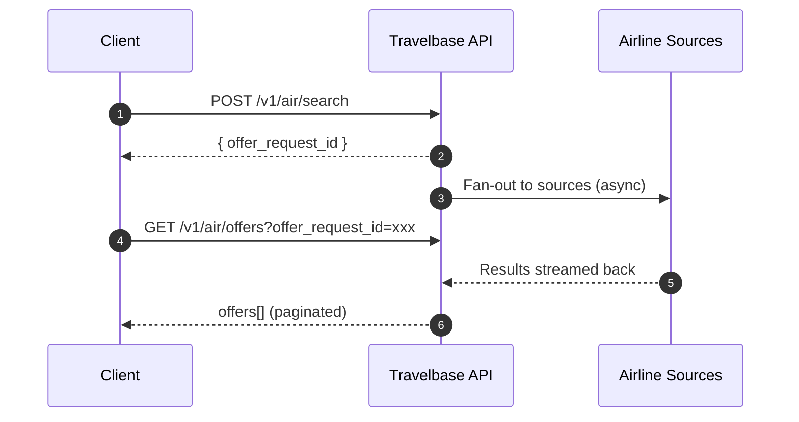

import { Steps, Step } from "@/components/steps";

<Info>
    Flight search in Travelbase is **asynchronous by design**. Offers are generated after your search request is created — not instantly. Understanding this model is critical to building fast, reliable travel experiences.
</Info>

---

## How it works

Travelbase uses a **two-phase search model**: you first create a search request to get an `offer_request_id`, then poll for offers using that ID. This decoupled pattern allows the API to fan out to multiple airline sources in parallel while your client stays responsive.



<CardGroup cols={2}>
    <Card title="Async-first pipeline" icon="bolt-lightning">
        Search requests are non-blocking. Offers are generated in the background across multiple airline sources simultaneously.
    </Card>
    <Card title="Session-scoped offers" icon="clock">
        Every `offer_request_id` is a short-lived snapshot of a search query. Offers are grouped, paginated, and cached under this ID until expiry.
    </Card>
    <Card title="Progressive retrieval" icon="arrow-down-to-line">
        You don't need to wait for all offers. Begin rendering results as they arrive — ideal for perceived performance.
    </Card>
    <Card title="Conversion-critical UX" icon="chart-line-up">
        Search responsiveness directly affects booking conversion. Travelbase is optimised for sub-second time-to-first-offer.
    </Card>
</CardGroup>

---

## Quickstart

<Steps>

    <Step title="Create a search request">

        Send a `POST` request with your origin, destination, dates, and passenger details. The API responds immediately with an `offer_request_id`.

        ```bash
        POST /v1/air/search
        Content-Type: application/json
        Authorization: Bearer <token>
        ```

        ```json
        {
            "slices": [
        {
            "origin": "LOS",
            "destination": "LHR",
            "departure_date": "2025-09-14"
        }
            ],
            "passengers": [
        { "type": "adult" }
            ],
            "cabin_class": "economy"
        }
        ```

        **Response**

        ```json
        {
            "data": {
            "id": "orq_0000AEdFhpGJONOOGfwXTH",
            "created_at": "2025-03-25T10:00:00Z",
            "expires_at": "2025-03-25T10:30:00Z",
            "slices": [...],
            "passengers": [...]
        }
        }
        ```

        <Tip>
            Store the `offer_request_id` in session state immediately after receiving it. You will need it for every subsequent offers request.
        </Tip>

    </Step>

    <Step title="Fetch available offers">

        Poll `GET /v1/air/offers` using your `offer_request_id`. Offers populate progressively — begin rendering as soon as the first page returns.

        ```bash
        GET /v1/air/offers?offer_request_id=orq_0000AEdFhpGJONOOGfwXTH&limit=20
        Authorization: Bearer <token>
        ```

        **Response**

        ```json
        {
            "data": [
        {
            "id": "off_0000AEdFkLPQNPPHhwYUJk",
            "total_amount": "432.50",
            "total_currency": "USD",
            "slices": [...],
            "owner": { "iata_code": "BA", "name": "British Airways" },
            "expires_at": "2025-03-25T10:28:00Z"
        }
            ],
            "meta": {
            "limit": 20,
            "after": "cursor_abc123",
            "returned": 20
        }
        }
        ```

        <Note>
            An empty `data` array does **not** mean the search failed. It means offers haven't populated yet. Retry after a short delay.
        </Note>

    </Step>

    <Step title="Paginate through results">

        Use the `after` cursor from the previous response to fetch the next page.

        ```bash
        GET /v1/air/offers?offer_request_id=orq_0000AEdFhpGJONOOGfwXTH&limit=20&after=cursor_abc123
        ```

        Continue until `meta.after` is `null` or you have enough results for your UI. Avoid fetching all results in a single unbounded request.

    </Step>

</Steps>

---

## Key concepts

### Offer request

An **offer request** is a time-bound snapshot of a flight search query. It acts as the anchor for all offers returned by that search.

| Property | Description |
|---|---|
| `id` | Unique identifier — pass as `offer_request_id` when fetching offers |
| `created_at` | Timestamp when the search was initiated |
| `expires_at` | Offers become unavailable after this time — typically **30 minutes** |
| `slices` | The origin/destination/date combinations searched |
| `passengers` | Passenger types included in pricing |

<Warning>
    Once an offer request expires, **you cannot retrieve its offers**. If a user is still browsing, create a new search to refresh results before they attempt to book.
</Warning>

### Offer

An **offer** represents a complete, bookable itinerary returned for a given search. Offers are airline-sourced and priced in real time.

| Property | Description |
|---|---|
| `id` | Unique offer ID — required to create an order |
| `total_amount` | Total price for all passengers |
| `total_currency` | ISO 4217 currency code |
| `expires_at` | Hard deadline for booking this specific offer |
| `owner` | The airline responsible for fulfilment |

---

## API reference

<CardGroup cols={2}>
    <Card title="POST /v1/air/search" icon="magnifying-glass" href="/api-reference/air/create-search">
        Create a new offer request. Returns an `offer_request_id` immediately.
    </Card>
    <Card title="GET /v1/air/offers" icon="list" href="/api-reference/air/list-offers">
        Retrieve paginated offers for an existing offer request.
    </Card>
    <Card title="GET /v1/air/offers/:id" icon="circle-info" href="/api-reference/air/get-offer">
        Fetch full details and fare conditions for a single offer.
    </Card>
    <Card title="POST /v1/air/orders" icon="bag-shopping" href="/api-reference/air/create-order">
        Convert an offer into a confirmed booking.
    </Card>
</CardGroup>

---

## Best practices

<CardGroup cols={3}>
    <Card title="Debounce search input" icon="hand">
        Avoid firing a new search request on every keystroke. Debounce by **400–600ms** or trigger only on form submission.
    </Card>
    <Card title="Paginate, never bulk-fetch" icon="layer-group">
        Always use `limit` and `after` cursors. Fetching all offers in one call is slow, expensive, and unnecessary.
    </Card>
    <Card title="Cache the offer request ID" icon="database">
        Persist `offer_request_id` in session or component state for the duration of the search flow — don't recreate searches unnecessarily.
    </Card>
    <Card title="Handle empty responses gracefully" icon="circle-exclamation">
        An empty `data` array is a valid transient state. Show a loading indicator and retry — don't surface an error to the user.
    </Card>
    <Card title="Show progressive results" icon="signal">
        Render each page of offers as it arrives. Don't wait for all pages before displaying results to the user.
    </Card>
    <Card title="Respect offer expiry" icon="timer">
        Check `expires_at` before presenting an offer for booking. Refresh the search if expiry is imminent.
    </Card>
</CardGroup>

---

## Common mistakes

<AccordionGroup>

    <Accordion title="Expecting synchronous, instant results" icon="triangle-exclamation">
        The search endpoint returns an `offer_request_id` — **not offers**. Offers are generated asynchronously. If your integration blocks on the first call waiting for offers, it will always time out.

        **Fix:** Separate the search creation step from the offer retrieval step. Poll `GET /v1/air/offers` with a short backoff until results appear.
    </Accordion>

    <Accordion title="Treating an empty response as an error" icon="triangle-exclamation">
        Early polling attempts often return `"data": []`. This is expected — sources are still streaming results back.

        **Fix:** Retry with exponential backoff (e.g. 500ms → 1s → 2s) up to a maximum of ~10 seconds before surfacing a 'no results' state.
    </Accordion>

    <Accordion title="Fetching all offers in a single request" icon="triangle-exclamation">
        Omitting `limit` or requesting a very large page causes high latency and degraded performance for all users.

        **Fix:** Always set `limit` (recommended: `20–50`). Use the `after` cursor to load more on demand or in the background.
    </Accordion>

    <Accordion title="Not storing the offer request ID" icon="triangle-exclamation">
        Re-creating a search request on every poll fires redundant API calls, consumes rate limit quota, and introduces unnecessary latency.

        **Fix:** Create the search once per user query. Store `offer_request_id` and reuse it for all subsequent `GET /v1/air/offers` calls until expiry.
    </Accordion>

    <Accordion title="Presenting expired offers for booking" icon="triangle-exclamation">
        Attempting to book an offer after its `expires_at` will return a `422 Unprocessable Entity`. This creates a frustrating dead-end for users.

        **Fix:** Compare `offer.expires_at` against the current time before initiating the booking flow. If expired, prompt the user to refresh the search.
    </Accordion>

</AccordionGroup>

---

## Error reference

| HTTP Status | Code | Meaning |
|---|---|---|
| `400` | `invalid_search_params` | Malformed request body — check required fields |
| `404` | `offer_request_not_found` | The `offer_request_id` doesn't exist or belongs to another account |
| `410` | `offer_request_expired` | The offer request has passed its `expires_at` — create a new search |
| `422` | `offer_no_longer_available` | The specific offer expired or sold out before booking |
| `429` | `rate_limit_exceeded` | Too many requests — implement exponential backoff |
---

## Next steps

<CardGroup cols={3}>
    <Card title="Book an offer" icon="ticket" href="/guides/create-order">
        Convert an offer into a confirmed booking with passenger details and payment.
    </Card>
    <Card title="Manage orders" icon="clipboard-list" href="/guides/manage-orders">
        Handle post-booking actions — cancellations, changes, and seat selection.
    </Card>
    <Card title="Webhooks" icon="bell" href="/guides/webhooks">
        Subscribe to real-time events for order status, schedule changes, and more.
    </Card>
</CardGroup>