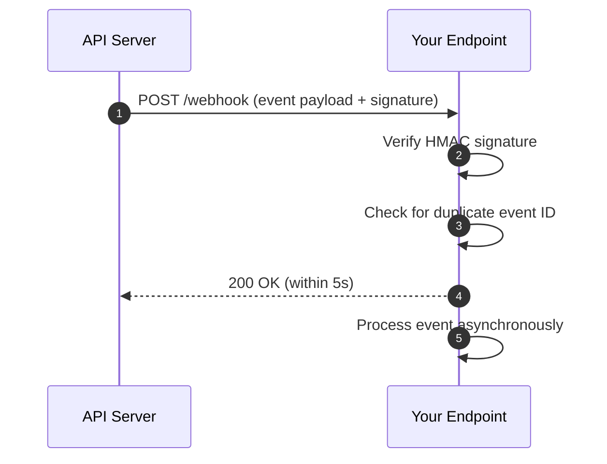

## Event Types
Every event payload includes a `type` field that identifies what occurred. The current event catalog:

<Table>
    <Thead>
        <Tr>
            <Th>Event</Th>
            <Th>Trigger</Th>
            <Th>Typical action</Th>
        </Tr>
    </Thead>
    <Tbody>
        <Tr>
            <Td>`order.created`</Td>
            <Td>A new order has been submitted</Td>
            <Td>Reserve inventory, send confirmation email</Td>
        </Tr>
        <Tr>
            <Td>`order.ticketed`</Td>
            <Td>Tickets have been issued for the order</Td>
            <Td>Deliver tickets to the customer</Td>
        </Tr>
        <Tr>
            <Td>`order.failed`</Td>
            <Td>Order processing encountered a terminal error</Td>
            <Td>Notify customer, release held inventory</Td>
        </Tr>
        <Tr>
            <Td>`wallet.updated`</Td>
            <Td>A wallet balance has changed</Td>
            <Td>Refresh balance display, trigger reconciliation</Td>
        </Tr>
    </Tbody>
</Table>

<Callout type="info">
    Subscribe only to the event types your integration needs. Unnecessary subscriptions increase processing overhead and
    expose more surface area to errors.
</Callout>

---

## Delivery Model

<CardGroup cols={2}>
    <Card title="At-least-once delivery" icon="repeat">
        Every event is guaranteed to be delivered — but may arrive more than once. Your handler must be idempotent. Use
        the event `id` field to deduplicate.
    </Card>
    <Card title="Automatic retries" icon="refresh-cw">
        If your endpoint does not return a `2xx` status within the timeout window, delivery is retried with exponential
        backoff across multiple attempts before the event is marked failed.
    </Card>
</CardGroup>

<Callout type="warning">
    **Ordering is not guaranteed.** An `order.ticketed` event may arrive before its corresponding `order.created` event
    under retry conditions. Always design handlers to tolerate out-of-order delivery.
</Callout>

---

## Request Format

Every webhook is a `POST` request with the following structure:

```http
POST /your-webhook-endpoint HTTP/1.1
Content-Type: application/json
X-Signature: t=1714000000,v1=a3f...9c2
X-Delivery-ID: del_01HXZ9K3BVMQ7GFNEW4ARTY5C8

{
  "id": "evt_01HXZ9K3BVMQ7GFNEW4ARTY5C8",
  "type": "order.created",
  "created_at": "2024-04-25T10:00:00Z",
  "data": {
    "order_id": "ord_99XABCDE",
    "amount": 12000,
    "currency": "usd"
  }
}
```

| Field | Description |
|---|---|
| `id` | Unique event identifier — use this for deduplication |
| `type` | The event type from the catalog above |
| `created_at` | ISO 8601 timestamp of when the event was generated |
| `data` | Event-specific payload — shape varies by `type` |

---

## Delivery Flow



<Callout type="warning">
    Respond with `200 OK` **immediately** after verification — before any business logic runs. If processing takes
    longer than the timeout window, the delivery is considered failed and retried.
</Callout>

---

## Signature Verification

Every webhook request includes an `X-Signature` header. Verifying it proves the request originated from the API and was not tampered with in transit.

### Signature format

```
X-Signature: t=<timestamp>,v1=<hmac>
```

- `t` — Unix timestamp of when the request was sent
- `v1` — HMAC-SHA256 of the signed payload using your webhook secret

### Signed payload construction

The string that is signed is formed by concatenating the timestamp, a literal period, and the raw request body:

```
<timestamp>.<raw_body>
```

### Verification implementation

```ts
import { createHmac, timingSafeEqual } from "crypto";

function verifyWebhookSignature(
  rawBody: string,
  signatureHeader: string,
  secret: string,
  toleranceSeconds = 300
): boolean {
  const parts = Object.fromEntries(
    signatureHeader.split(",").map((p) => p.split("="))
  );

  const timestamp = parseInt(parts["t"], 10);
  const receivedHmac = parts["v1"];

  // Reject stale requests
  const age = Math.floor(Date.now() / 1000) - timestamp;
  if (age > toleranceSeconds) {
    throw new Error(`Webhook timestamp too old: ${age}s`);
  }

  // Recompute expected HMAC
  const signedPayload = `${timestamp}.${rawBody}`;
  const expected = createHmac("sha256", secret)
    .update(signedPayload)
    .digest("hex");

  // Compare in constant time to prevent timing attacks
  const a = Buffer.from(expected, "hex");
  const b = Buffer.from(receivedHmac, "hex");

  if (a.length !== b.length) return false;
  return timingSafeEqual(a, b);
}
```

<Callout type="danger">
    Never use string equality (`===`) to compare HMACs. Use `timingSafeEqual` to prevent timing attacks that could allow
    an attacker to forge valid signatures.
</Callout>

---

## Handling Duplicates

Because delivery is at-least-once, your handler will receive the same event more than once. Guard against this by tracking processed event IDs:

```ts
async function handleWebhook(event: WebhookEvent) {
  const alreadyProcessed = await db.processedEvents.exists(event.id);
  if (alreadyProcessed) {
    console.log(`Skipping duplicate event: ${event.id}`);
    return; // Return 200 — do not reprocess
  }

  await db.processedEvents.create({ id: event.id, receivedAt: new Date() });
  await processEvent(event); // Your business logic
}
```

<Callout type="info">
    Store processed event IDs with a TTL that matches the maximum retry window of the delivery system (typically 72
    hours). There is no need to retain them indefinitely.
</Callout>

---

## Retry Schedule

When delivery fails, the system retries with exponential backoff:

| Attempt | Delay | Cumulative time |
|---|---|---|
| 1 (initial) | — | 0s |
| 2 | 30s | 30s |
| 3 | 5 min | ~5 min |
| 4 | 30 min | ~35 min |
| 5 | 2 hours | ~2h 35 min |
| 6 (final) | 5 hours | ~7h 35 min |

After the final attempt, the event is marked as `failed` and no further delivery is attempted. You can manually replay failed events from the dashboard or via the API.

---

## Implementation Checklist

<Steps>
    <Step title="Register your endpoint">
        Provide a publicly accessible HTTPS URL. HTTP endpoints are rejected.
    </Step>
    <Step title="Store your webhook secret securely">
        Retrieve your signing secret from the dashboard and store it in an environment variable — never hardcode it.
    </Step>
    <Step title="Verify the signature on every request">
        Reject any request that fails HMAC verification before touching the payload.
    </Step>
    <Step title="Respond 200 before processing">
        Acknowledge receipt immediately. Offload business logic to a background queue.
    </Step>
    <Step title="Deduplicate using event ID">
        Check the event `id` against your store before processing. Return `200` for duplicates without reprocessing.
    </Step>
    <Step title="Handle out-of-order events">
        Use `created_at` timestamps and idempotent state transitions to safely handle events that arrive out of
        sequence.
    </Step>
</Steps>

---

## Best Practices

<CardGroup cols={3}>
    <Card title="Verify every signature" icon="shield-check">
        Treat any request that fails signature verification as hostile. Log and discard it immediately.
    </Card>
    <Card title="Respond fast, process async" icon="zap">
        Acknowledge within the timeout window. Push processing to a queue — never block the HTTP response on business
        logic.
    </Card>
    <Card title="Idempotent handlers" icon="repeat-2">
        Design every handler to produce the same outcome when called multiple times with the same event.
    </Card>
</CardGroup>

---

## Common Mistakes

| Mistake | Consequence | Fix |
|---|---|---|
| Trusting unverified payloads | Attackers can forge events and trigger unintended actions | Always verify HMAC before reading `data` |
| Blocking on business logic before responding | Delivery timeout triggers unnecessary retries | Return `200` first, process in a background job |
| Not handling duplicate events | Double-processing causes data corruption, duplicate charges | Deduplicate on `event.id` with a processed-events store |
| Using string equality for HMAC comparison | Vulnerable to timing attacks that allow signature forgery | Use `timingSafeEqual` or equivalent |
| Ignoring the `t` timestamp | Replay attacks can resend valid old payloads | Reject requests where `t` is older than 5 minutes |
| Returning non-2xx for already-seen events | The system interprets it as a failure and retries indefinitely | Always return `200` for duplicates |

---

## Related

- [Idempotency & Retries](/docs/idempotency-retries)
- [Error Handling & Status Codes](/docs/error-handling)
- [Event Replay](/docs/event-replay)
- [Security Best Practices](/docs/security)