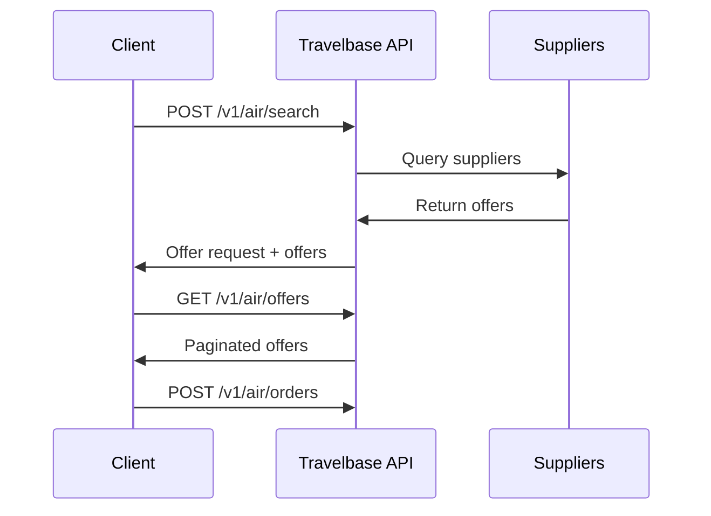

The Offers API allows you to search for flights and retrieve priced itineraries from airline and supplier systems.

Offers represent **priced flight options** that can be booked by creating an order.

---
## Overview

Offer retrieval is a two-step process:

1. Create an offer request
2. Retrieve offers associated with that request

This design ensures:

- Deterministic search results
- Supplier timeout isolation
- Async supplier aggregation support
- Pagination support
- Reliable pricing consistency

---

## Offer Lifecycle



# Create Offers Request

``` http
 POST /v1/air/search
Creates an offer request and optionally returns available offers.
This endpoint initiates a supplier search across airline systems.
```

# Request Body

```json
{
  "data": {
    "slices": [
      {
        "origin": "JFK",
        "destination": "LAX",
        "departure_date": "2026-03-22"
      }
    ],
    "passengers": [
      {
        "type": "adult"
      }
    ],
    "cabin_class": "economy"
  },
  "return_offers": true,
  "supplier_timeout": 2
}
```

### Request Fields

| Field | Type | Required | Description |
|---|---|---|---|
| data | object | Yes | Offer request parameters |
| data.slices | array | Yes | Flight segments |
| data.passengers | array | Yes | Passenger list |
| data.cabin_class | string | Yes | Cabin class |
| return_offers | boolean | No | Return offers immediately |
| supplier_timeout | integer | No | Supplier timeout in seconds, ensure it's greater or equals to 2  |

---

### Slice Object

Defines a flight segment.

```json
{
  "origin": "JFK",
  "destination": "LAX",
  "departure_date": "2026-03-22"
}
```

### Passenger Object
```josn {
"type": "adult"
}
```
#### Supported passenger types:
- adult
- child
- infant_without_seat

## Cabin Classes
Supported values:
- economy
- premium_economy
- business
- first

# Example Request
```curl
curl https://sandbox.travelbase.ai/v1/air/search \
  -X POST \
  -H "x-api-key: YOUR_API_KEY" \
  -H "Content-Type: application/json" \
  -d '{
    "data": {
      "slices": [
        {
          "origin": "JFK",
          "destination": "LAX",
          "departure_date": "2026-03-22"
        }
      ],
      "passengers": [
        {
          "type": "adult"
        }
      ],
      "cabin_class": "economy"
    },
    "return_offers": true
  }'
```

# Response
```json
 {

"success": true,
"message": "Flight search completed successfully",
"data": [{
  "id": "off_123",
  "object": "offer",
  "total_amount": "210.00",
  "currency": "USD",
  "expires_at": "2026-02-23T19:25:43Z",
  "slices": [
    {
      "origin": "JFK",
      "destination": "LAX",
      "segments": [
        {
          "departure_airport": "JFK",
          "arrival_airport": "LAX",
          "departure_time": "2026-03-22T08:00:00Z",
          "arrival_time": "2026-03-22T11:00:00Z",
          "airline": "AA",
          "flight_number": "AA100"
        }
      ]
    }
  ],
  "passengers": [
    {
      "type": "adult"
    }
  ]
}]}
```

## Pagination

This endpoint supports cursor-based pagination for efficient retrieval of large result sets.

Use the `limit`, `after`, and `before` parameters to navigate between pages.

### Example

# Filtering Connections

```text
You can restrict the maximum number of flight connections returned.
This is useful when showing only direct flights or limiting travel complexity.
```

## Retrieve an Offer

`GET /v1/air/offers/:id`

Retrieve a single offer by ID to view specific pricing and itinerary details before booking.

### Path Parameters

| Parameter | Description |
| :--- | :--- |
| `id` | The unique identifier for the Offer. |

### Query Parameters

| Parameter | Description |
| :--- | :--- |
| `return_available_services` | Include optional services such as seats and baggage. |

---

### Example Request

```bash
curl [https://sandbox.travelbase.ai/v1/air/offers/off_123](https://sandbox.travelbase.ai/v1/air/offers/off_123) \
  -H "x-api-key: tb_live_xxxxxxxxx"
```

# Response
```json
{
  "id": "off_123",
  "object": "offer",
  "total_amount": "210.00",
  "currency": "USD",
  "expires_at": "2026-02-23T19:25:43Z",
  "slices": [
    {
      "origin": "JFK",
      "destination": "LAX",
      "segments": [
        {
          "departure_airport": "JFK",
          "arrival_airport": "LAX",
          "departure_time": "2026-03-22T08:00:00Z",
          "arrival_time": "2026-03-22T11:00:00Z",
          "airline": "AA",
          "flight_number": "AA100"
        }
      ]
    }
  ],
  "passengers": [
    {
      "type": "adult"
    }
  ]
}
```

---

## The Offer Object

An **Offer** is a time-sensitive, priced itinerary. It represents the final "quote" provided by a supplier before a booking is finalized. Because airline pricing is dynamic, these objects are ephemeral and must be consumed before they expire.

### Attributes

| Field | Type | Description |
| :--- | :--- | :--- |
| `id` | `string` | Unique identifier for the offer. |
| `object` | `string` | The type of object (always `offer`). |
| `total_amount` | `string` | The total price including all taxes and fees. |
| `currency` | `string` | Three-letter ISO currency code (e.g., `USD`, `EUR`). |
| `expires_at` | `string` | ISO 8601 timestamp indicating when the offer expires. |
| `slices` | `array` | A list of flight slices (legs) included in the itinerary. |
| `passengers` | `array` | The list of passengers and their associated pricing breakdown. |

---

### Offer Expiration

Offers expire after a supplier-defined duration. **Expired offers cannot be booked.** If the `expires_at` timestamp has passed, you must initiate a new offer request to retrieve fresh availability and pricing. Attempting to book an expired offer will result in an error.

### Pagination

The list endpoint supports cursor-based pagination to manage large result sets efficiently.

```http
GET /v1/air/search?limit=10&after=cursor
```


## Best Practices

<CardGroup cols={3}>

    <Card title="Cache Request IDs" icon="database">
        Store the `offer_request_id` to quickly refresh results for a user session.
    </Card>

    <Card title="Avoid Long-term Storage" icon="clock">
        Offers are ephemeral. Do not store them in long-term databases.
    </Card>

    <Card title="Verification" icon="shield-check">
        Always verify the `expires_at` field on the client side before allowing a user to proceed to the booking stage.
    </Card>

    <Card title="Performance" icon="list">
        Use the `limit` parameter to paginate results and keep your UI responsive.
    </Card>

    <Card title="Timeouts" icon="timer">
        Respect supplier timeouts to ensure optimal system performance and user experience.
    </Card>

</CardGroup>

---

## Next Steps

<CardGroup cols={1}>
    <Card title="Create Order" icon="arrow-right" href="/tenant-api/orders">
        Book an offer and issue a ticket by creating an order.
    </Card>
</CardGroup>
