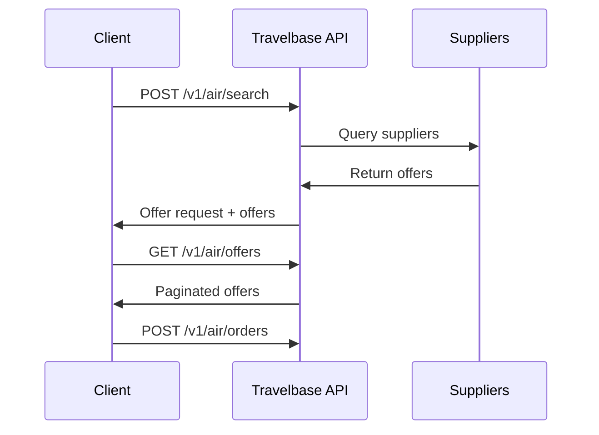

The Offers API allows you to search for flights and retrieve priced itineraries from airline and supplier systems.

Offers represent **priced flight options** that can be booked by creating an order.

---

## Overview

Offer retrieval is a two-step process:

1. Create an offer request
2. Retrieve offers associated with that request

This design ensures:

- Deterministic search results
- Supplier timeout isolation
- Async supplier aggregation support
- Pagination support
- Reliable pricing consistency

---

## Offer Lifecycle



# Create Offers Request

``` http
 POST /v1/air/search
Creates an offer request and optionally returns available offers.
This endpoint initiates a supplier search across airline systems.
```

# Request Body

```json
{
  "data": {
    "slices": [
      {
        "origin": "JFK",
        "destination": "LAX",
        "departure_date": "2026-03-22"
      }
    ],
    "passengers": [
      {
        "type": "adult"
      }
    ],
    "cabin_class": "economy"
  },
  "return_offers": true,
  "supplier_timeout": 2
}
```

### Request Fields

| Field | Type | Required | Description |
|---|---|---|---|
| data | object | Yes | Offer request parameters |
| data.slices | array | Yes | Flight segments |
| data.passengers | array | Yes | Passenger list |
| data.cabin_class | string | Yes | Cabin class |
| return_offers | boolean | No | Return offers immediately |
| supplier_timeout | integer | No | Supplier timeout in seconds, ensure it's greater or equals to 2  |

---

### Slice Object

Defines a flight segment.

```json
{
  "origin": "JFK",
  "destination": "LAX",
  "departure_date": "2026-03-22"
}
```

### Passenger Object
```josn {
"type": "adult"
}
```
#### Supported passenger types:
- adult
- child
- infant_without_seat

## Cabin Classes
Supported values:
- economy
- premium_economy
- business
- first

# Example Request
```curl
curl https://sandbox.travelbase.ai/v1/air/search \
  -X POST \
  -H "x-api-key: YOUR_API_KEY" \
  -H "Content-Type: application/json" \
  -d '{
    "data": {
      "slices": [
        {
          "origin": "JFK",
          "destination": "LAX",
          "departure_date": "2026-03-22"
        }
      ],
      "passengers": [
        {
          "type": "adult"
        }
      ],
      "cabin_class": "economy"
    },
    "return_offers": true
  }'
```

# Response
```json
 {              "success": true,
                "message": "Flight search completed successfully",
                "data": [{
                "total_emissions_kg": "637",
                "intended_total_amount": "224.24",
                "intended_services": null,
                "intended_base_amount": "190.04",
                "available_airline_credit_ids": [],
                "payment_requirements": {
                    "requires_instant_payment": false,
                    "price_guarantee_expires_at": "2026-03-15T17:37:32Z",
                    "payment_required_by": "2026-03-16T17:37:32Z"
                },
                "available_services": null,
                "supported_passenger_identity_document_types": [
                    "passport",
                    "known_traveler_number",
                    "passenger_redress_number"
                ],
                "passenger_identity_documents_required": false,
                "tax_currency": "USD",
                "base_currency": "USD",
                "supported_loyalty_programmes": [
                    "AA",
                    "AS",
                    "CX",
                    "MH",
                    "BA",
                    "AY",
                    "UL",
                    "QF",
                    "IB",
                    "JM",
                    "QR",
                    "UM",
                    "RJ",
                    "AT"
                ],
                "base_amount": "190.04",
                "private_fares": [],
                "tax_amount": "34.20",
                "total_currency": "USD",
                "slices": [
                    {
                        "comparison_key": "Az2Siw==",
                        "ngs_shelf": 1,
                        "destination_type": "airport",
                        "origin_type": "airport",
                        "fare_brand_name": "Basic Economy",
                        "segments": [
                            {
                                "origin_terminal": "2",
                                "destination_terminal": "1",
                                "aircraft": null,
                                "departing_at": "2026-03-22T16:15:00",
                                "arriving_at": "2026-03-22T19:07:00",
                                "operating_carrier": {
                                    "logo_symbol_url": "https://assets.Partner.com/img/airlines/for-light-background/full-color-logo/AA.svg",
                                    "logo_lockup_url": "https://assets.Partner.com/img/airlines/for-light-background/full-color-lockup/AA.svg",
                                    "conditions_of_carriage_url": "https://www.aa.com/i18n/customer-service/support/conditions-of-carriage.jsp",
                                    "iata_code": "AA",
                                    "name": "American Airlines",
                                    "id": "arl_00009VME7DAGiJjwomhv32"
                                },
                                "marketing_carrier": {
                                    "logo_symbol_url": "https://assets.Partner.com/img/airlines/for-light-background/full-color-logo/AA.svg",
                                    "logo_lockup_url": "https://assets.Partner.com/img/airlines/for-light-background/full-color-lockup/AA.svg",
                                    "conditions_of_carriage_url": "https://www.aa.com/i18n/customer-service/support/conditions-of-carriage.jsp",
                                    "iata_code": "AA",
                                    "name": "American Airlines",
                                    "id": "arl_00009VME7DAGiJjwomhv32"
                                },
                                "stops": [],
                                "operating_carrier_flight_number": "10",
                                "marketing_carrier_flight_number": "10",
                                "passengers": [
                                    {
                                        "baggages": [
                                            {
                                                "quantity": 1,
                                                "type": "checked"
                                            },
                                            {
                                                "quantity": 1,
                                                "type": "carry_on"
                                            }
                                        ],
                                        "cabin_class_marketing_name": "Economy",
                                        "passenger_id": "pas_0000B4DoPPc0RKbD6VCDcA",
                                        "cabin": {
                                            "amenities": {
                                                "wifi": {
                                                    "cost": "paid",
                                                    "available": true
                                                },
                                                "seat": {
                                                    "pitch": "30",
                                                    "legroom": "n/a",
                                                    "type": null
                                                },
                                                "power": {
                                                    "available": true
                                                }
                                            },
                                            "marketing_name": "Economy",
                                            "name": "economy"
                                        },
                                        "fare_basis_code": "Y20LGTN2",
                                        "cabin_class": "economy"
                                    }
                                ],
                                "distance": "3974.2717774447433",
                                "media": [],
                                "duration": "PT5H52M",
                                "destination": {
                                    "iata_country_code": "US",
                                    "iata_city_code": "LAX",
                                    "city_name": "Los Angeles",
                                    "icao_code": "KLAX",
                                    "iata_code": "LAX",
                                    "latitude": 33.942045,
                                    "longitude": -118.408263,
                                    "city": {
                                        "iata_country_code": "US",
                                        "iata_city_code": "LAX",
                                        "city_name": null,
                                        "icao_code": null,
                                        "iata_code": "LAX",
                                        "latitude": null,
                                        "longitude": null,
                                        "time_zone": null,
                                        "type": "city",
                                        "name": "Los Angeles",
                                        "id": "cit_lax_us"
                                    },
                                    "time_zone": "America/Los_Angeles",
                                    "type": "airport",
                                    "name": "Los Angeles International Airport",
                                    "id": "arp_lax_us"
                                },
                                "origin": {
                                    "iata_country_code": "US",
                                    "iata_city_code": "NYC",
                                    "city_name": "New York",
                                    "icao_code": "KJFK",
                                    "iata_code": "JFK",
                                    "latitude": 40.640556,
                                    "longitude": -73.778519,
                                    "city": {
                                        "iata_country_code": "US",
                                        "iata_city_code": "NYC",
                                        "city_name": null,
                                        "icao_code": null,
                                        "iata_code": "NYC",
                                        "latitude": null,
                                        "longitude": null,
                                        "time_zone": null,
                                        "type": "city",
                                        "name": "New York",
                                        "id": "cit_nyc_us"
                                    },
                                    "time_zone": "America/New_York",
                                    "type": "airport",
                                    "name": "John F. Kennedy International Airport",
                                    "id": "arp_jfk_us"
                                },
                                "id": "seg_0000B4DoPPvrFWTk64U4Yb"
                            }
                        ],
                        "conditions": {
                            "advance_seat_selection": null,
                            "priority_check_in": null,
                            "priority_boarding": null,
                            "change_before_departure": {
                                "penalty_currency": null,
                                "penalty_amount": null,
                                "allowed": false
                            }
                        },
                        "duration": "PT5H52M",
                        "destination": {
                            "iata_country_code": "US",
                            "iata_city_code": "LAX",
                            "city_name": "Los Angeles",
                            "icao_code": "KLAX",
                            "iata_code": "LAX",
                            "latitude": 33.942045,
                            "longitude": -118.408263,
                            "city": {
                                "iata_country_code": "US",
                                "iata_city_code": "LAX",
                                "city_name": null,
                                "icao_code": null,
                                "iata_code": "LAX",
                                "latitude": null,
                                "longitude": null,
                                "time_zone": null,
                                "type": "city",
                                "name": "Los Angeles",
                                "id": "cit_lax_us"
                            },
                            "time_zone": "America/Los_Angeles",
                            "type": "airport",
                            "name": "Los Angeles International Airport",
                            "id": "arp_lax_us"
                        },
                        "origin": {
                            "iata_country_code": "US",
                            "iata_city_code": "NYC",
                            "city_name": "New York",
                            "icao_code": "KJFK",
                            "iata_code": "JFK",
                            "latitude": 40.640556,
                            "longitude": -73.778519,
                            "city": {
                                "iata_country_code": "US",
                                "iata_city_code": "NYC",
                                "city_name": null,
                                "icao_code": null,
                                "iata_code": "NYC",
                                "latitude": null,
                                "longitude": null,
                                "time_zone": null,
                                "type": "city",
                                "name": "New York",
                                "id": "cit_nyc_us"
                            },
                            "time_zone": "America/New_York",
                            "type": "airport",
                            "name": "John F. Kennedy International Airport",
                            "id": "arp_jfk_us"
                        },
                        "id": "sli_0000B4DoPPvrFWTk64U4Yc"
                    }
                ],
                "live_mode": false,
                "total_amount": "224.24",
                "created_at": "2026-03-13T17:37:32.896577Z",
                "passengers": [
                    {
                        "fare_type": null,
                        "loyalty_programme_accounts": [],
                        "family_name": null,
                        "given_name": null,
                        "age": null,
                        "type": "adult",
                        "id": "pas_0000B4DoPPc0RKbD6VCDcA"
                    }
                ],
                "conditions": {
                    "refund_before_departure": {
                        "penalty_currency": "GBP",
                        "penalty_amount": "30.00",
                        "allowed": true
                    },
                    "change_before_departure": {
                        "penalty_currency": null,
                        "penalty_amount": null,
                        "allowed": false
                    }
                },
                "updated_at": "2026-03-13T17:37:32.896577Z",
                "expires_at": "2026-03-13T18:07:32.896579Z",
                "partial": false,
                "owner": {
                    "logo_symbol_url": "https://assets.Partner.com/img/airlines/for-light-background/full-color-logo/AA.svg",
                    "logo_lockup_url": "https://assets.Partner.com/img/airlines/for-light-background/full-color-lockup/AA.svg",
                    "conditions_of_carriage_url": "https://www.aa.com/i18n/customer-service/support/conditions-of-carriage.jsp",
                    "iata_code": "AA",
                    "name": "American Airlines",
                    "id": "arl_00009VME7DAGiJjwomhv32"
                },
                "id": "off_0000B4DoPPvrFWTk64U4Yd",
                "provider_total_amount": "224.24",
                "provider_total_currency": "USD",
                "markup_bps": 0,
                "markup_amount": "0.00"
            }]
}
```

## Offer Object (Summary)

Each item in the `data` array represents a flight offer.

| Field | Type | Description |
|---|---|---|
| `id` | string | Unique identifier of the offer. |
| `object` | string | Object type. Always `offer`. |
| `total_amount` | string | Total price of the offer. |
| `currency` | string | ISO 4217 currency code. |
| `expires_at` | string | Timestamp indicating when the offer expires. |

[//]: # (<Card)

[//]: # (    title="Retrieve Full Offer Details")

[//]: # (    icon="arrow-right")

[//]: # (    href="/tenant-api/offers#get-v1-air-offers-id")

[//]: # (>)

[//]: # (    Use the offer ID to retrieve complete itinerary, segments, and available services.)

[//]: # (</Card>)

---

## Pagination

This endpoint supports cursor-based pagination for efficient retrieval of large result sets.

Use the `limit`, `after`, and `before` parameters to navigate between pages.

### Example

# Filtering Connections

```text
You can restrict the maximum number of flight connections returned.
This is useful when showing only direct flights or limiting travel complexity.
```

# Best Practices
<CardGroup cols={2}>
    <Card title="Cache offer_request_id" icon="database">
        Reuse the offer request ID to avoid unnecessary supplier searches.
    </Card>
    <Card title="Use pagination" icon="list">
        Large searches may return many offers. Use pagination to improve performance.
    </Card>
    <Card title="Respect expiration" icon="clock">
        Offers expire based on supplier rules. Always verify expiration before booking.
    </Card>
    <Card title="Fetch full offer before booking" icon="circle-check">
        Retrieve complete offer details before creating an order.
    </Card>
</CardGroup>

## Retrieve an Offer

`GET /v1/air/offers/:id`

Retrieve a single offer by ID to view specific pricing and itinerary details before booking.

### Path Parameters

| Parameter | Description |
| :--- | :--- |
| `id` | The unique identifier for the Offer. |

### Query Parameters

| Parameter | Description |
| :--- | :--- |
| `return_available_services` | Include optional services such as seats and baggage. |

---

### Example Request

```bash
curl [https://sandbox.travelbase.ai/v1/air/offers/off_123](https://sandbox.travelbase.ai/v1/air/offers/off_123) \
  -H "x-api-key: tb_live_xxxxxxxxx"
```

# Response
```json
{
"id": "off_123",
"object": "offer",
"total_amount": "210.00",
"currency": "USD",
"expires_at": "2026-02-23T19:25:43Z",
"slices": [
{
"origin": "JFK",
"destination": "LAX",
"segments": [
{
"departure_airport": "JFK",
"arrival_airport": "LAX",
"departure_time": "2026-03-22T08:00:00Z",
"arrival_time": "2026-03-22T11:00:00Z",
"airline": "AA",
"flight_number": "AA100"
}
]
}
],
"passengers": [
{
"type": "adult"
}
]
}
```

---

## The Offer Object

An **Offer** is a time-sensitive, priced itinerary. It represents the final "quote" provided by a supplier before a booking is finalized. Because airline pricing is dynamic, these objects are ephemeral and must be consumed before they expire.

### Attributes

| Field | Type | Description |
| :--- | :--- | :--- |
| `id` | `string` | Unique identifier for the offer. |
| `object` | `string` | The type of object (always `offer`). |
| `total_amount` | `string` | The total price including all taxes and fees. |
| `currency` | `string` | Three-letter ISO currency code (e.g., `USD`, `EUR`). |
| `expires_at` | `string` | ISO 8601 timestamp indicating when the offer expires. |
| `slices` | `array` | A list of flight slices (legs) included in the itinerary. |
| `passengers` | `array` | The list of passengers and their associated pricing breakdown. |

---

### Offer Expiration

Offers expire after a supplier-defined duration. **Expired offers cannot be booked.** If the `expires_at` timestamp has passed, you must initiate a new offer request to retrieve fresh availability and pricing. Attempting to book an expired offer will result in an error.

### Pagination

The list endpoint supports cursor-based pagination to manage large result sets efficiently.

```http
GET /v1/air/search?limit=10&after=cursor
```


## Best Practices

<CardGroup cols={2}>

    <Card title="Cache Request IDs" icon="database">
        Store the `offer_request_id` to quickly refresh results for a user session.
    </Card>

    <Card title="Avoid Long-term Storage" icon="clock">
        Offers are ephemeral. Do not store them in long-term databases.
    </Card>

    <Card title="Verification" icon="shield-check">
        Always verify the `expires_at` field on the client side before allowing a user to proceed to the booking stage.
    </Card>

    <Card title="Performance" icon="list">
        Use the `limit` parameter to paginate results and keep your UI responsive.
    </Card>

    <Card title="Timeouts" icon="timer">
        Respect supplier timeouts to ensure optimal system performance and user experience.
    </Card>

</CardGroup>

---

## Next Steps

<CardGroup cols={1}>
    <Card title="Create Order" icon="arrow-right" href="/tenant-api/orders">
        Book an offer and issue a ticket by creating an order.
    </Card>
</CardGroup>
