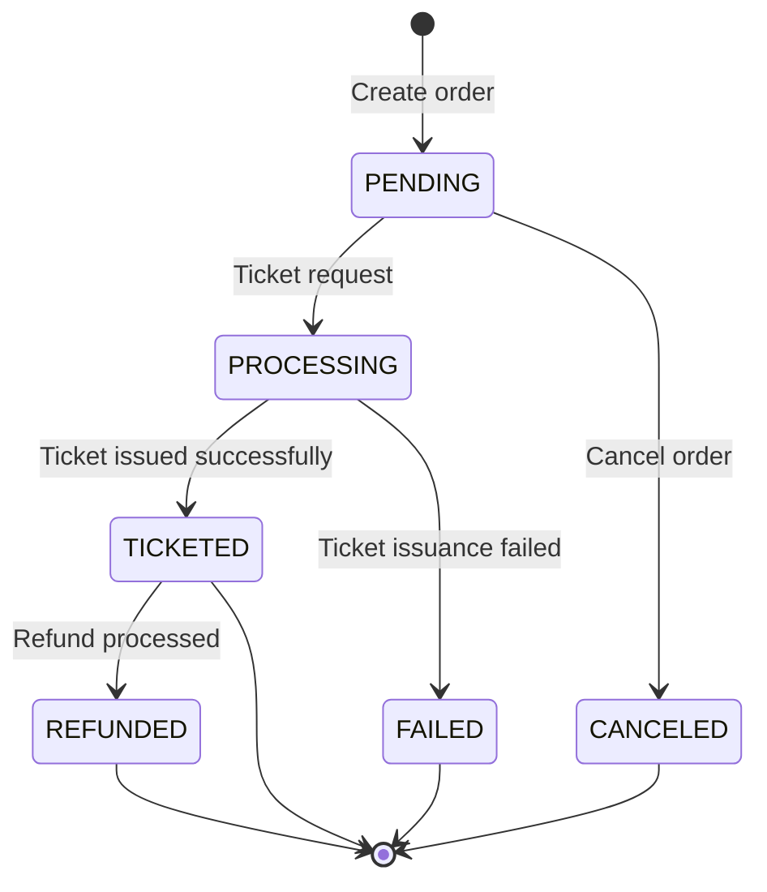

Orders represent a confirmed booking created from a selected offer. Once ticketed, an order contains issued tickets and becomes immutable.
Travelbase abstracts airline supplier complexity behind a unified, stable order lifecycle.

<CardGroup cols={2}>
    <Card title="Create Order" icon="cart-shopping">
        Convert an offer into a pending order.
    </Card>

    <Card title="Ticket Order" icon="ticket">
        Issue tickets and finalize the booking.
    </Card>
</CardGroup>

---

## Order lifecycle

Orders progress through a defined lifecycle:

| Status | Description |
|------|-------------|
| `PENDING` | Order created, awaiting ticketing |
| `PROCESSING` | Ticket issuance in progress |
| `TICKETED` | Tickets successfully issued |
| `FAILED` | Ticketing failed |
| `CANCELED` | Order canceled before ticketing |
| `REFUNDED` | Order refunded after ticketing |

<Note>
    Orders remain editable only while in the `PENDING` state.
    Once ticketed, the order becomes immutable.
</Note>

---

---

## Order state machine

Orders progress through a deterministic lifecycle managed by Travelbase. Each state represents a distinct phase in the booking and ticketing process.

Once an order reaches a terminal state, no further modifications are allowed unless explicitly supported (such as refunds).

### Lifecycle overview

- `PENDING` — Order created, awaiting ticketing
- `PROCESSING` — Ticket issuance in progress
- `TICKETED` — Tickets successfully issued (terminal)
- `FAILED` — Ticket issuance failed (terminal)
- `CANCELED` — Order canceled before ticketing (terminal)
- `REFUNDED` — Ticketed order has been refunded (terminal)

<Note>
    Orders are editable only in the <code>PENDING</code> state. Once ticketing begins, the order becomes immutable to
    ensure financial and ticketing consistency.
</Note>

---

### State transitions



## Create order

Creates a new order from a previously selected offer.

```http
POST /v1/air/orders`
```

### Headers

| Header | Required | Description |
|---|---|---|
| `Idempotency-Key` | Yes | Unique key to prevent duplicate bookings |

<Tip>
    Always generate a unique idempotency key per booking attempt. This ensures safe retries during network failures.
</Tip>

### Body

```json
{
  "offerId": "off_...",
  "passengers": [
    {
      "id": "psg_1",
      "given_name": "Test",
      "family_name": "Traveler",
      "born_on": "1990-01-01",
      "gender": "m",
      "title": "mr",
      "email": "test@example.com",
      "phone_number": "+12025550123"
    }
  ],
  "services": [],
  "metadata": {
    "reference": "ABC-123"
  }
}
```

# Response

```json
{
"id": "ord_7f9a2c3d",
"status": "PENDING",
"totalCents": 26032,
"currency": "USD",
"createdAt": "2026-02-20T16:25:51.293Z"
}
```

# Update passengers

Updates passenger information for an existing order.
Only allowed while order status is PENDING.

# Endpoints

``` http
POST /v1/air/orders/:id/passengers
PUT  /v1/air/orders/:id/passengers
```

# Body
The request body must be a JSON object with the following structure:

```json

{
"passengers": [
{
"id": "psg_1",
"given_name": "Updated",
"family_name": "Traveler"
}
]
}
```

<Warning> Passenger updates are rejected once ticketing begins. </Warning>

## Ticket order

Issues airline tickets and finalizes the order.

`POST /v1/air/orders/:id/ticket`

### Headers

| Header | Required | Description |
|---|---|---|
| Idempotency-Key | Yes | Prevent duplicate ticket issuance |

### Response

```json
{
  "order": {
    "id": "ord_7f9a2c3d",
    "status": "TICKETED",
    "currency": "USD"
  }
}
```

<Tip> Ensure your Travelbase wallet has sufficient balance before ticketing. </Tip>

## List orders

Returns recent orders.

`GET /v1/air/orders`

### Query parameters

| Parameter | Required | Description |
|---|---|---|
| limit | No | Number of orders to return (default: 25) |
| status | No | Filter by order status |

### Example

```http
GET /v1/air/orders?status=TICKETED&limit=10
```

# Retrieve order
Fetches an order with its offer snapshot.

```http
GET /v1/air/orders/:id
```

# Response

```json
{
"order": {
"id": "ord_7f9a2c3d",
"status": "TICKETED",
"currency": "USD"
},
"offer": {
"id": "off_123",
"total_amount": "260.32"
}
}
```
<Note> The offer snapshot represents the exact pricing and itinerary used during booking, ensuring financial
    correctness, auditability, and replay safety. </Note>

## Idempotency

Travelbase uses idempotency keys to guarantee safe retries.

If a request with the same idempotency key is retried, Travelbase returns the original response instead of creating duplicate orders or issuing duplicate tickets.

<Card
    title="Learn about idempotency"
    icon="shield-check"
    href="/tenant-api/concepts#idempotency"
>
    Understand how idempotency prevents duplicate bookings and ensures safe retries.
</Card>

---

## Architecture abstraction

Travelbase provides a unified, supplier-agnostic order interface.

This ensures:

- consistent API behavior
- predictable order lifecycle
- simplified integration
- supplier-independent infrastructure
- forward compatibility as airline systems evolve

<Note>
    Travelbase manages airline communication, ticket issuance, and settlement internally. Your integration remains
    stable without requiring supplier-specific handling.
</Note>

---

## Error handling

Travelbase returns standard HTTP status codes.

### Example error

```json
{
  "error": {
    "type": "insufficient_balance",
    "message": "Wallet balance is insufficient for ticketing."
  }
}
```
## Common error types

The following errors may occur when creating, modifying, or ticketing an order.

| Error | Description |
|---|---|
| `insufficient_balance` | Wallet balance is too low to complete ticketing |
| `invalid_offer` | Offer has expired, is invalid, or cannot be used |
| `order_not_found` | Order does not exist or cannot be located |
| `order_not_pending` | Order cannot be modified because it is no longer in the `PENDING` state |
| `idempotency_conflict` | Duplicate idempotency key was used for a different request |

<Note>
    Order operations are state-dependent. Always verify the order <code>status</code> and ensure sufficient wallet
    balance before performing ticketing operations.
</Note>

<Tip>
    Use a unique <code>Idempotency-Key</code> for each order creation or ticketing request to ensure safe retries and
    prevent duplicate bookings.
</Tip>

## Next steps

<CardGroup cols={2}>

    <Card
        title="Search offers"
        icon="magnifying-glass"
        href="/tenant-api/offers"
    >
        Find flight offers to create orders.
    </Card>

    <Card
        title="Wallet"
        icon="wallet"
        href="/tenant-api/wallet"
    >
        Manage your balance required for ticket issuance.
    </Card>

</CardGroup>